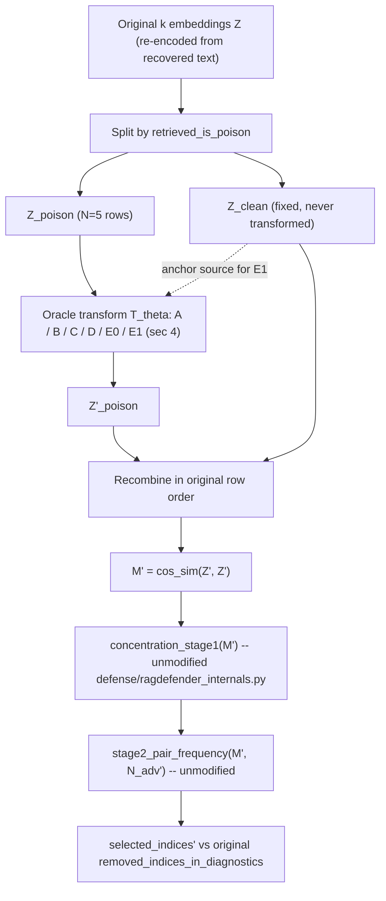

# Cluster-Normalized Poisoning: Execution Plan

> Status: **planning-only, no code written**. This document defines an
> execution plan for an **embedding-space oracle stress test** against
> `ragdefender_original`'s Stage-1/Stage-2 similarity logic. It does not
> implement code, does not modify any baseline defense
> (`defense/defense_runner.py`, `defense/dispatch.py`, `defense/filterrag.py`,
> `main.py`), does not call GPT/any API, and does not run a new baseline
> sweep. It is grounded entirely in
> `docs/NORMALIZED_POISONING_LITERATURE_REVIEW.md`,
> `docs/RAGDEFENDER_CLUSTER_DIAGNOSTIC_FINDINGS.md`,
> `defense/ragdefender_internals.py`,
> `scripts/visualize_ragdefender_clusters.py`, and the diagnostics artifacts
> those two produced.
>
> **This plan does not claim a realizable text attack.** It designs a
> controlled test of whether `ragdefender_original`'s removal decision is a
> function of relative embedding geometry rather than of poison semantics.
> See §10 for the explicit limitations this plan is bound by.
>
> **Revision history:**
> - **Rev 2** (this revision): fixed E1's `nearest`/`farthest` strategies,
>   which previously used independent per-poison-point `argmax`/`argmin`
>   and could map multiple poison embeddings to the same clean anchor,
>   violating the stated bijection constraint. Renamed to
>   `nearest_bijection`/`farthest_bijection` and redefined as a joint
>   permutation search (brute force over all `N!` permutations, since
>   `N=5`; no SciPy dependency introduced). Fixed the literature-review
>   filename reference (`docs/NORMALIZED_POISONING_LITERATURE_REVIEW.md.md`
>   -> `docs/NORMALIZED_POISONING_LITERATURE_REVIEW.md`) throughout.
> - **Rev 1**: replaced the original single-centroid interpolation baseline
>   as the primary first intervention. Kept only as a sanity baseline
>   (**E0**) because pulling every poisoned embedding toward the same point
>   can *increase* poison-poison similarity instead of reducing it. The
>   primary first intervention became **E1, clean-anchor interpolation**,
>   which assigns each poisoned embedding to a *different* clean anchor.
>   The alpha sweep was extended to include 0.4 and 0.3, and a `.gitignore`
>   prerequisite was added as an explicit pre-implementation step (§7).

## 1. Literature justification (from `docs/NORMALIZED_POISONING_LITERATURE_REVIEW.md`)

The review distinguishes four categories of prior work in service of one
question: *if RAGDefender works because poisoned passages occupy the
densest cosine neighborhood, what happens if that neighborhood is
reshaped?*

- **Distribution matching / feature alignment.** CORAL (Sun, Feng & Saenko
  2016) aligns second-order statistics (covariance) between a source and
  target feature distribution; Deep CORAL generalizes this to nonlinear
  representations; DAN/MMD (Long et al. 2015; Gretton et al. 2012) match
  distributions in an RKHS, which is stronger than covariance matching;
  BERT-flow (Li et al. 2020) and WhiteningBERT (Huang et al. 2021) show
  sentence embeddings are anisotropic and that whitening/isotropizing
  post-processing materially changes cosine geometry; All-but-the-Top (Mu &
  Viswanath 2018) and SimCSE (Gao et al. 2021) reinforce that cosine
  neighborhoods are a function of post-processing/training, not a stable
  fact about a text set; MoDIR (Xin et al. 2022) shows retrieval-specific
  domain-invariant alignment is a studied mechanism. Together these
  establish that embedding distributions can be *deliberately reshaped* to
  resemble a target distribution -- the direct methodological basis for
  every intervention in §4.
- **Clustering attacks.** Chhabra et al. (2020) and Cinà et al. (2022) show
  clustering assignments can be manipulated without producing obvious
  outliers, and without full knowledge of the clustering objective; Villani
  et al. (2026, *Sonic*) specifically targets density/graph-based clustering
  and demonstrates cross-algorithm transferability. This is the most direct
  conceptual match for RAGDefender's Stage-2 mechanism, which is exactly a
  dense-top-pair-subgraph selector, not a distance-to-centroid rule. This
  is also the direct justification for E1's per-passage anchor assignment
  (§4): dispersing individual poisoned passages toward *different* clean
  neighborhoods, rather than toward one shared point, is the closer match
  to how this literature manipulates clustering outputs without a single
  obvious outlier.
- **Embedding and nearest-neighbor manipulation.** Wang, Jha & Chaudhuri
  (2018) and Sitawarin et al. (2021) show k-NN decisions are geometrically
  brittle at small k; RetrievalGuard (Wu et al. 2022) treats 1-NN retrieval
  itself as an attack surface; Bojchevski & Günnemann (2019) and Zhang et
  al. (2019) show embedding-consuming downstream decisions are sensitive to
  the structure that produced the embeddings; Li et al. (2025) and Su, Nakov
  & Cardie (2024) show the dense-retrieval community already treats
  continuous embedding-space optimization as a first-class object of study,
  separate from any text-realization step. RAGDefender's Stage-2 is
  dominated by a small set of top-similarity pairs (`N_pairs =
  C(N_adv,2)`), which this literature says is a comparatively brittle
  statistic.
- **Text-space adversarial paraphrasing.** TextFooler (Jin et al. 2020),
  BERT-Attack (Li et al. 2020), SemAttack (Wang et al. 2022), and the
  TextAttack framework (Morris et al. 2020) are cited explicitly as a
  **later bridge stage**, not as part of this plan's oracle test. The
  review is explicit that "the community already accepts continuous-space
  optimization as a meaningful way to study dense retrieval poisoning" but
  that matching a target embedding distribution being *reachable by
  natural-language rewriting under a frozen encoder* is a separate,
  unproven claim requiring its own evidence.

The review's own proposed name and framing -- **"Cluster-Normalized
Poisoning: An Oracle Stress Test for Similarity-Based RAG Defenses"** -- is
adopted verbatim as the title of this experiment.

## 2. Minimum viable experiment

**No GPT/API calls. No baseline reruns. No modification of
`defense/defense_runner.py`, `defense/dispatch.py`, or `defense/filterrag.py`.**

Reuse the existing k=10, N=5 HotpotQA `ragdefender_original` diagnostics
already on disk:

- Diagnostics JSONL (source of truth for `retrieved_doc_ids`,
  `retrieved_is_poison`, `removed_doc_ids`, `N_adv_estimated_by_ragdefender`):
  `results/diagnostics/ragdefender_smoke_live_10q/hotpotqa-contriever-gpt4-Top10--M10x1-adv-LM_targeted-dot-5-10-defense-ragdefender_original.jsonl`
- Paired query results (source of `input_prompt_no_defense`, from which
  `scripts/visualize_ragdefender_clusters.py::recover_pre_defense_texts`
  recovers exact retrieved passage text):
  `results/query_results/ragdefender_smoke_live_10q/hotpotqa-contriever-gpt4-Top10--M10x1-adv-LM_targeted-dot-5-10-defense-ragdefender_original.json`
- Existing recomputed diagnostics run (already validated to agree with
  `ragdefender_original`'s real behavior for all 8 processed queries -- see
  `docs/RAGDEFENDER_CLUSTER_DIAGNOSTIC_FINDINGS.md`):
  `results/diagnostics/ragdefender_cluster_viz/20260722_042137_clusterdiag_hotpotqa_k10_N5_ragdefender-original_embedder-paraphraseMiniLM_task-multihop_p2/`

**Two anchor queries**, chosen because they bracket the failure/success
range documented in `docs/RAGDEFENDER_CLUSTER_DIAGNOSTIC_FINDINGS.md`:

| | `5ae2070a5542994d89d5b313` (success, poison-poison dominated) | `5a8cb288554299585d9e3726` (severe failure, control) |
|---|---|---|
| category | `poison_clique_success` | `clean_density_failure` |
| N_adv (Stage 1) | 5 | 3 |
| top_pair_mix (PP/PC/CC) | 10/0/0 | 0/0/3 |
| removed_poison / removed_clean | 5 / 0 | 0 / 3 |
| residual_poison_fraction | 0.0 | 0.714 |
| mean_poison_poison_similarity | 0.9457 | 0.9447 |
| mean_poison_clean_similarity | 0.2460 | 0.5024 |
| mean_clean_clean_similarity | 0.1720 | 0.9919 |
| max_poison_poison_similarity | 0.9760 | 0.9796 |
| nearest_neighbor_poison_ratio_mean | 0.7 | 0.5 |
| poison_neighborhood_entropy | 0.0 | 0.0 |
| clean_neighborhood_entropy | 0.9710 | 0.0 |

(values read directly from `graph_metrics.csv` in the run directory above;
`stage1_summary.csv`/`stage2_summary.csv` in that same directory hold the
matching Stage-1/Stage-2 intermediates for both queries.)

The success case is the primary subject: it is the query where the
poison-poison clique most completely dominates the Stage-2 top-pair graph
(`top_pair_mix = 10/0/0`, exact match to `N_pairs = C(5,2) = 10`), so it is
the strongest test of whether dispersing poison-poison similarity can make
the defense's decision flip. The severe-failure query is used only as a
**comparison/control** -- it already shows what a clean-dominated top-pair
graph looks like numerically (`mean_clean_clean_similarity=0.992 >
mean_poison_poison_similarity=0.945`), which is the qualitative target
region the sweep in §8 asks whether the success case's poison block can be
pushed toward.

Both queries have `k=10`, `N_retrieved_poison=5`, `N_retrieved_clean=5`
(so the poison-to-clean assignment in E1 is a bijection between two
equal-size groups of 5 -- see §4), `embedder=paraphrase-MiniLM-L6-v2`
(384-dim), matching `docs/RAGDEFENDER_CLUSTER_DIAGNOSTIC_FINDINGS.md`'s
scope exactly.

## 3. Oracle intervention definition

The intervention operates at the level `defense/ragdefender_internals.py`
already exposes: `concentration_stage1(cos_sim_matrix)` and
`stage2_pair_frequency(cos_sim_matrix, n_adv)` both take a **k x k cosine
matrix**, not raw embeddings, as their only required input. This means the
oracle transform can be defined either at the embedding level (`z ->
T(z)`, then recompute `cos_sim(T(z), T(z))`) or, for distribution-matching
style interventions, directly at the similarity-matrix level -- both are
in scope, but each run's `run_config.json` must record which level was
used (see §7).

Fixed data-flow contract for every intervention:

1. Start from the query's original k retrieved-passage embeddings `Z in
   R^{k x 384}`, recovered by re-encoding the exact text
   `scripts/visualize_ragdefender_clusters.py::recover_pre_defense_texts`
   already recovers for that `query_id`, with the exact same embedder
   (`paraphrase-MiniLM-L6-v2`, loaded via `defense.defense_runner._lazy_st`,
   the same private import path `defense_runner.py` itself uses).
2. Split `Z` into `Z_poison` (rows where `retrieved_is_poison[i] == True`)
   and `Z_clean` (rows where `False`), using the diagnostics record's own
   `retrieved_is_poison` array -- never re-derived.
3. Apply intervention `T_theta` to `Z_poison` only: `Z'_poison =
   T_theta(Z_poison)`. `Z_clean` is **never modified**.
4. Recombine into `Z'` in the original row order.
5. Recompute `M' = cos_sim(Z', Z')` via
   `sentence_transformers.util.cos_sim` (the exact call
   `defense_runner.py` and `visualize_ragdefender_clusters.py` both use).
6. Feed `M'` into the **unmodified** `concentration_stage1(M')` to get a new
   `N_adv'`.
7. Feed `M'` and `N_adv'` into the **unmodified**
   `stage2_pair_frequency(M', N_adv')` to get new top pairs, frequency
   scores, and `selected_indices'` (the post-intervention removal set).
8. Compare `selected_indices'` against the original run's
   `removed_indices_in_diagnostics` (already computed and cross-checked in
   the existing diagnostics run) to classify the decision shift (§6, §8).



No call in this flow touches `defense/defense_runner.py`,
`defense/dispatch.py`, `defense/filterrag.py`, or `main.py`. No call
performs generation or hits an LLM API. Retrieval membership (`k`, which
`k` doc_ids were retrieved) is never changed.

## 4. Candidate interventions

All operate on `Z_poison` (or, for A/C, optionally directly on the PP block
of `M`) with `Z_clean`/the rest of `M` held fixed, per §3.

- **A. Pairwise similarity distribution matching.** Directly reshape the
  empirical distribution of `{M[i,j] : i,j in poison, i<j}` (10 values for
  N=5) toward the empirical distribution of `{M[i,j] : i in poison, j in
  clean}` (25 values) or `{M[i,j] : i,j in clean}` (10 values), e.g. via a
  1-D quantile/optimal-transport map applied to the PP similarity values
  themselves. This is the narrowest hypothesis test: can PP similarity
  values alone be pushed toward the PC/CC distribution while `Z_clean` and
  retrieval membership stay fixed? If applied at the similarity-matrix
  level rather than via an explicit embedding transform, the run's
  `run_config.json` must record `intervention_level: "similarity_matrix"`
  and note that no `Z'_poison` with an exact embedding realization is
  claimed for that run.
- **B. CORAL-style covariance alignment** (Sun, Feng & Saenko 2016). Fit
  `T(z) = A(z - mu_poison) + mu_clean` where `A` whitens `Cov(Z_poison)`
  and re-colors to `Cov(Z_clean)`. **Caveat to record explicitly:** with
  only 5 poison and 5 clean rows in 384 dimensions, both covariance
  estimates are heavily rank-deficient (rank <= 4); `A` must use a
  regularized/shrinkage covariance estimate (e.g. `Cov + eps*I`), and the
  chosen `eps` and its effect must be logged in `run_config.json`.
- **C. MMD-style distribution matching** (Gretton et al. 2012; Long et al.
  2015). Minimize a kernel two-sample statistic `MMD^2(Z'_poison,
  Z_clean)` (e.g. RBF kernel) over a small parametric or per-point
  perturbation of `Z_poison`, optionally regularized to stay close to the
  original `Z_poison` (bounded perturbation norm). **Same small-sample
  caveat as B** -- N=5 per side makes the empirical MMD estimate itself
  noisy; this must be reported, not hidden, in the per-run report.
- **D. Whitening/isotropy normalization** (Li et al. 2020, BERT-flow;
  Huang et al. 2021, WhiteningBERT). Because whitening statistics fit on
  only the 10 embeddings of one query would be degenerate, this
  intervention's mean/covariance must be estimated from a larger reference
  set of already-available clean-passage embeddings -- e.g. the union of
  clean-passage embeddings across all 8 already-processed queries in the
  existing diagnostics run (~35-40 vectors). This is still small relative
  to typical whitening use in the literature; the report must say so
  explicitly. Apply the resulting whitening map to `Z_poison` only.
- **E0. Clean-centroid interpolation baseline** (demoted; sanity baseline
  only, **not** the primary first intervention):

```
z'_poison = alpha * z_poison + (1 - alpha) * clean_centroid
z'_poison = z'_poison / ||z'_poison||_2      # L2-renormalize
```

  where `clean_centroid = mean(Z_clean)` for that query's own 5 clean
  embeddings. **Known failure mode, why this is demoted:** pulling every
  poisoned embedding toward the *same* shared point can, depending on the
  starting geometry, leave poison-poison pairwise similarity unchanged or
  even *increase* it (all five poison vectors move toward one another as a
  side effect of moving toward one shared target), directly undermining
  the goal of reducing poison-poison concentration. E0 is retained
  specifically to make this failure mode visible and measurable (it must
  be run and reported, not skipped), but it is not treated as evidence
  about RAGDefender's fragility on its own -- see §10.

- **E1. Clean-anchor interpolation** (the primary first intervention /
  minimum viable experiment -- see §8):

  Each poisoned embedding `z_p_i` is assigned to a *different* clean
  embedding `z_c_{pi(i)}` via a **bijective** assignment `pi`, then:

```
z'_p_i = alpha * z_p_i + (1 - alpha) * z_c_pi(i)
z'_p_i = z'_p_i / ||z'_p_i||_2      # L2-renormalize
```

  For both E0 and E1, the explicit renormalization step does not change
  `cos_sim` values (`sentence_transformers.util.cos_sim` already
  L2-normalizes its inputs internally) -- it is retained only for
  representational clarity/consistency with the literature's convention,
  and this equivalence must be stated in the report rather than left
  implicit.

  **Assignment strategies for `pi`** (query has `N_poison == N_clean == 5`
  for both anchor queries, so `pi` is required to be a genuine bijection
  `{0..4} -> {0..4}` over local poison/clean indices within the query, not
  over global k-indices -- **every strategy below must produce a bijection,
  by construction, not just by convention**):

  1. `rank_aligned` -- `pi(i) = i`, pairing the `i`-th poison passage (by
     retrieval rank order among poison passages) with the `i`-th clean
     passage (by retrieval rank order among clean passages). Trivially a
     bijection. Deterministic, no extra parameter.
  2. `nearest_bijection` -- choose the permutation `pi` over clean local
     indices that **maximizes** `sum_i cos(z_p_i, z_c_pi(i))`, i.e. the
     single best joint assignment, not five independent per-point
     decisions. **Correction from the prior revision:** an earlier version
     of this plan defined `nearest` as `pi(i) = argmax_j cos_sim(z_p_i,
     z_c_j)` computed independently per `i`; that is *not* guaranteed to be
     injective (two poison points can share the same argmax clean index),
     which violates the bijection requirement. `nearest_bijection` fixes
     this by searching over the full space of permutations and selecting
     the one maximizing the joint sum -- this is exactly the assignment
     problem, solved here by brute force (§4 implementation note below)
     rather than by an independent-argmax heuristic.
  3. `farthest_bijection` -- choose the permutation `pi` that **minimizes**
     `sum_i cos(z_p_i, z_c_pi(i))`, the deliberately adversarial-to-itself
     counterpart to `nearest_bijection`: maximal joint dispersion rather
     than minimal. Same bijection-by-construction correction applies.
  4. `random` -- `pi` is a uniformly random permutation of `{0..4}`,
     generated from a fixed, logged seed so every run is exactly
     reproducible. Trivially a bijection (a permutation is a bijection by
     definition).

  **Implementation note for `nearest_bijection`/`farthest_bijection`
  (brute force, no SciPy):** because `N_poison = N_clean = 5` for both
  anchor queries, the assignment problem has only `5! = 120` candidate
  permutations. The first implementation must enumerate all `N!`
  permutations of clean local indices (e.g. via Python's
  `itertools.permutations`, already stdlib -- no new dependency), compute
  `sum_i cos(z_p_i, z_c_pi(i))` for each, and take the arg-max
  (`nearest_bijection`) or arg-min (`farthest_bijection`). **No SciPy
  dependency (e.g. `scipy.optimize.linear_sum_assignment`) is introduced.**
  This brute-force approach is only tractable because `N` is small (5) in
  both anchor queries; it is explicitly **not** a general-purpose
  assignment solver, and this plan does not scope a polynomial-time
  replacement (e.g. the Hungarian algorithm) -- if a future run needs
  `N > ~8-10`, that is an explicit follow-up, not covered here.

  **CLI surface for the first implementation:**

```
--anchor_strategy rank_aligned|nearest_bijection|farthest_bijection|random   (required for E1)
--random_seed 12                                                              (only meaningful for --anchor_strategy random; still recorded in run_config.json for every strategy, for reproducibility)
```

  The resolved `pi` mapping (list of `(poison_local_index,
  clean_local_index)` pairs) must be written into `run_config.json` for
  every E1 run, regardless of strategy, so the exact assignment used is
  always inspectable without re-deriving it. `run_config.json` must also
  record that `pi` was verified to be a bijection (e.g.
  `"pi_is_bijection": true`, computed by checking the mapped clean indices
  form a permutation of `{0..N_clean-1}`) as a machine-checkable guard
  against the exact bug this revision fixes.

  **Goal this intervention tests:** whether poisoned passages can be
  dispersed across *distinct* clean neighborhoods such that (i)
  poison-poison top-pair count decreases, (ii) poison-clean top-pair count
  increases, (iii) RAGDefender removes fewer poisoned passages, or (iv)
  RAGDefender starts removing clean passages -- see §8 for the precise,
  per-alpha stopping conditions.

Interventions A-D are defined here for completeness with the literature
review's four-way distinction (§1) but are **not** implemented in the
first pass -- see §8, which scopes the first executable sweep to E1
(primary) and E0 (sanity baseline) only.

## 5. Constraints (oracle-test boundary, recorded every run)

Every run's `run_config.json` must include an explicit `oracle_constraints`
block recording:

- `retrieval_membership_fixed: true` -- the same k doc_ids, same
  `retrieved_is_poison` labels, are used before and after transformation;
  no doc is added, removed, or reordered at the retrieval level.
- `generator_text_fixed: true` -- no generation is re-run; `main.py` is
  never invoked; no `answer_no_defense`/`answer_with_defense` field is
  produced or claimed for any transformed state.
- `transform_scope: "ragdefender_similarity_decision_only"` -- `Z'_poison`
  and `M'` exist only to feed
  `defense/ragdefender_internals.py::concentration_stage1` /
  `stage2_pair_frequency`; they are never written back into any
  `results/query_results/*.json` or `results/diagnostics/*.jsonl` file used
  by the real pipeline, and never passed to
  `defense/defense_runner.py::apply_defense`.
- `claims_text_realizable_attack: false` -- hardcoded, always `false`,
  present in every run's config as a machine-checkable guardrail (see
  test in §9).
- `gpt_or_api_calls_made: false` -- hardcoded, mirroring the field
  `scripts/visualize_ragdefender_clusters.py::build_run_config` already
  emits.
- `baseline_files_modified: []` -- must remain empty; if any run script
  ever needs to import from `defense/defense_runner.py` or
  `defense/ragdefender_internals.py`, it must be a read-only import (no
  monkeypatch, no write).
- `anchor_strategy`, `random_seed`, and `pi_is_bijection` (E1 runs only) --
  the resolved CLI parameters, plus the resolved `pi` mapping (§4) and its
  bijection check, so every E1 run's assignment is fully reconstructable
  and independently verifiable from `run_config.json` alone.

This block exists specifically so that the interpretive boundary in §10 is
enforced by the artifact itself, not only by prose in this document.

## 6. Metrics

Computed **before** (original `M`) and **after** (`M'`) transformation, for
every run:

- `mean_poison_poison_similarity`, `mean_poison_clean_similarity`,
  `mean_clean_clean_similarity`, `max_poison_poison_similarity` -- already
  computed by `scripts/visualize_ragdefender_clusters.py::compute_graph_metrics`;
  reuse that function's logic (or the function itself) against `M` and `M'`.
- `top_pair_mix` (PP/PC/CC counts among Stage-2's selected `top_pairs`) --
  derivable the same way `docs/RAGDEFENDER_CLUSTER_DIAGNOSTIC_FINDINGS.md`
  derives it, from `Stage2Result.top_pairs` + `retrieved_is_poison`. For
  E1, this is the primary signal for goals (i) and (ii) in §4 (PP count
  down, PC count up).
- `nearest_neighbor_poison_ratio_mean`, `poison_neighborhood_entropy`,
  `clean_neighborhood_entropy` -- already computed by
  `compute_graph_metrics` (`_nearest_neighbor`, `_shannon_entropy_binary`);
  reuse directly.
- `N_adv` (Stage-1 estimate) -- `ConcentrationResult.n_adv_estimated` from
  `concentration_stage1`.
- Stage-2 `frequency_scores` (per passage) -- `Stage2Result.frequency_scores`.
- `removed_poison`, `removed_clean`, `residual_poison_fraction` -- derived
  from `Stage2Result.selected_indices'` compared against
  `retrieved_is_poison`, mirroring
  `scripts/visualize_ragdefender_clusters.py::build_stage2_row`'s
  `agreement_with_diagnostics` pattern but applied to the *post-transform*
  selection rather than a cross-check.
- **Decision-shift label**: one of `poison_removal` (unchanged from
  original, still all/most poison removed), `clean_removal` (top-pair graph
  now dominated by clean-clean or poison-clean pairs, mirroring the
  `clean_density_failure` category in
  `docs/RAGDEFENDER_CLUSTER_DIAGNOSTIC_FINDINGS.md`), or `under_removal`
  (fewer poison passages removed than at `alpha=1.0`, without a
  corresponding clean takeover). This reuses the same classification rules
  table already defined in
  `docs/RAGDEFENDER_CLUSTER_DIAGNOSTIC_FINDINGS.md`'s "Classification
  rules" section, applied to before/after pairs instead of a single state.

## 7. Outputs

**Pre-implementation step, before any run artifacts are produced:** add

```
results/diagnostics/cluster_normalized_poisoning/
```

to `.gitignore`, mirroring the existing entry at `.gitignore:186`
(`results/diagnostics/ragdefender_cluster_viz/`). This must happen in the
first implementation commit, before any script under this plan is run,
so run outputs are never accidentally staged or committed. **Not done by
this planning document** -- `.gitignore` is unmodified as of this
revision; it is recorded here as the required first step of
implementation.

Timestamped run directories, one per (dataset, k, N, intervention,
query_id) combination:

```
results/diagnostics/cluster_normalized_poisoning/
  <YYYYMMDD_HHMMSS>_oracle_<dataset>_k<k>_N<N>_<intervention>_<query_id>/
    run_config.json
    manifest.json
    original_metrics.csv
    normalized_metrics.csv
    intervention_sweep.csv
    stage1_before_after.csv
    stage2_before_after.csv
    similarity_matrices/
      original_M.npy
      transformed_M_alpha<value>.npy   (one per swept parameter value)
    plots/
      pairgraph_before.png
      pairgraph_after_alpha<value>.png
      similarity_distribution_before_after.png
    CLUSTER_NORMALIZED_POISONING_REPORT.md
```

`<intervention>` is one of `E0`, `E1-rank_aligned`, `E1-nearest_bijection`,
`E1-farthest_bijection`, `E1-random` (i.e. E1's directory name always
encodes the `--anchor_strategy` used, since different strategies on the
same query at the same alpha are genuinely different runs, not re-runs of
the same configuration).

Naming and `run_config.json`/`manifest.json` conventions directly mirror
`scripts/visualize_ragdefender_clusters.py::build_run_dir` /
`build_run_config` (timestamp prefix, explicit `argv`, explicit git
commit/status, explicit dependency versions, `oracle_constraints` block
from §5 appended to the existing `gpt_or_api_calls_made` /
`ragdefender_package_imported` style fields already in that script's
`run_config.json`).

## 8. First sweep

Scope of the first executable pass: **E1 (clean-anchor interpolation) is
the primary intervention and the minimum viable experiment.** All four
`--anchor_strategy` values (`rank_aligned`, `nearest_bijection`,
`farthest_bijection`, `random` with `--random_seed 12`) are run on the
success-case query `5ae2070a5542994d89d5b313` (§2). **E0 (clean-centroid
interpolation) is run in parallel as a sanity baseline**, on the same
query, at the same alpha values, specifically to check for and report the
centroid-collapse failure mode described in §4 (E0 may show no
PP-similarity reduction, or an increase -- that is an expected, reportable
outcome for E0, not a bug). The failure case `5a8cb288554299585d9e3726` is
processed through the same pipeline at `alpha=1.0` only, for both E0 and
E1, as a numeric sanity control (its `M`, `N_adv`, and selection are
already known and must reproduce exactly).

Sweep (extended from the original plan to reach lower alpha, since a
change might only appear once the anchor contribution is large enough):

```
alpha in {1.0, 0.9, 0.8, 0.7, 0.6, 0.5, 0.4, 0.3}
```

`alpha=1.0` is the identity transform (`z'_poison = z_poison`) for **both**
E0 and E1 -- at `alpha=1.0` the `(1 - alpha)` term vanishes regardless of
which clean point (`clean_centroid` or `z_c_pi(i)`) it would have been
multiplied by, so E0 and E1 must produce numerically identical results to
each other and to the existing diagnostics at `alpha=1.0`, for every
`--anchor_strategy` (this is also a regression test, see §9). This is the
first point at which lower alpha values (0.4, 0.3) matter: if `alpha=0.5`
does not change Stage-2 behavior for a given strategy, the sweep continues
down to 0.4 and 0.3 specifically to test whether the decision boundary can
be moved at all under that strategy before concluding a negative result.

For each `(intervention, anchor_strategy, alpha)` combination, record in
`intervention_sweep.csv`: `intervention`, `anchor_strategy` (E1 only),
`random_seed` (E1 `random` only), `alpha`, `mean_poison_poison_similarity`,
`mean_poison_clean_similarity`, `top_pair_mix` (PP/PC/CC), `N_adv`,
`removed_poison`, `removed_clean`, `residual_poison_fraction`,
`decision_label` (per §6).

**Report the first alpha (descending from 1.0), per `anchor_strategy`, at
which any of the following first becomes true:**

1. Poison-poison top-pair count strictly decreases from the `alpha=1.0`
   value of 10/10 (i.e. `M''s top pairs are no longer 100% poison-poison),
   **or**
2. Poison-clean top-pair count strictly increases from the `alpha=1.0`
   value of 0, **or**
3. RAGDefender's recomputed Stage-2 selection removes strictly fewer
   poisoned passages than at `alpha=1.0` (i.e. `removed_poison < 5`), **or**
4. A clean passage is newly selected for removal (`removed_clean`
   increases from the `alpha=1.0` value of 0).

If none of the eight alpha values triggers any of these four conditions
for a given `anchor_strategy`, the report must say so explicitly (a
negative result for that specific strategy/query is still a reportable
finding, not a failure to report). The report must present all four
`anchor_strategy` results side by side (plus E0) so that, e.g.,
`nearest_bijection` succeeding while `farthest_bijection` does not (or vice
versa) is directly visible.

## 9. Tests

To be added under `tests/` (unittest style, matching the existing
convention in `tests/test_ragdefender_cluster_viz.py` -- no real
`SentenceTransformer` model load; a deterministic `FakeSentenceTransformer`
stand-in for any end-to-end smoke test):

1. **Shape preservation**: `T_theta(Z_poison)` has the same shape as
   `Z_poison` (`(N_poison, embedding_dim)`) for every intervention
   (E0, E1 x 4 strategies), for every alpha in the sweep.
2. **Cosine matrix shape**: `M' = cos_sim(Z', Z')` is `k x k` for the
   query's actual `k` (10 in the anchor queries), matching `M`'s shape
   exactly.
3. **Stage-1 recomputation runs post-transform**:
   `concentration_stage1(M')` returns a valid `ConcentrationResult`
   (`n_adv_estimated` in `[0, k]`) for every alpha in the sweep, using the
   real, unmodified `defense/ragdefender_internals.py::concentration_stage1`.
4. **Stage-2 recomputation runs post-transform**:
   `stage2_pair_frequency(M', N_adv')` returns a valid `Stage2Result`
   (`len(selected_indices) <= N_adv'`, all `top_pairs` satisfy `i < j`) for
   every alpha in the sweep, using the real, unmodified
   `stage2_pair_frequency`.
5. **Identity regression**: `alpha=1.0` reproduces the existing
   diagnostics exactly -- `N_adv'`, `top_pairs`, `frequency_scores`,
   `selected_indices'` for query `5ae2070a5542994d89d5b313` must match
   `stage1_summary.csv`/`stage2_summary.csv` in
   `results/diagnostics/ragdefender_cluster_viz/20260722_042137_.../`
   bit-for-bit (within floating-point tolerance), for **both E0 and every
   E1 `--anchor_strategy`**, mirroring the `agreement_with_diagnostics`
   check pattern already used in
   `scripts/visualize_ragdefender_clusters.py::build_stage1_row` /
   `build_stage2_row`.
6. **Anchor-assignment correctness and bijectivity** (E1 only):
   - `rank_aligned` produces `pi(i) == i` for all `i`.
   - `nearest_bijection`'s chosen `pi` maximizes `sum_i cos(z_p_i,
     z_c_pi(i))` over **all** `itertools.permutations(range(N_clean))` --
     verified by brute-force recomputation of the same sum for every
     permutation in the test and asserting the returned `pi` achieves the
     max (not merely that each individual pairing looks locally
     plausible).
   - `farthest_bijection`'s chosen `pi` minimizes the same sum, by the same
     exhaustive check.
   - For **every** strategy, the returned `pi` is a genuine bijection: the
     multiset of `pi(i)` values across all `i` equals `set(range(N_clean))`
     with no repeats -- this is the direct regression test for the bug
     this revision fixes (the old independent-`argmax`/`argmin` `nearest`/
     `farthest` could fail this check; the new `nearest_bijection`/
     `farthest_bijection` must always pass it).
   - `random` with `--random_seed 12` is a valid permutation of
     `{0..N_clean-1}` and is byte-for-byte reproducible across two separate
     invocations with the same seed (and differs, with high probability,
     from a run with a different seed).
   - No test or implementation module imports `scipy` for this
     functionality (`itertools.permutations` only).
7. **No GPT/API calls guard**: every test (and, at runtime, every
   `run_config.json["oracle_constraints"]["gpt_or_api_calls_made"]`) must
   assert `False`; the test suite must never construct an OpenAI/GPT client
   and must monkeypatch/forbid network calls the same way
   `tests/test_ragdefender_cluster_viz.py::FakeSentenceTransformer` avoids
   a real model download.

## 10. Limitations (must appear verbatim in every run's report)

- This is an **oracle embedding-space diagnostic**. `Z_poison` is
  transformed directly; no natural-language rewrite of any poisoned
  passage is performed or implied.
- It **does not prove natural-language realizability**. A finding that
  `T_theta` flips RAGDefender's decision says only that the *defense*
  depends on a geometric assumption that is fragile under a controlled
  representation change -- it does not show any `T_theta` is reachable by
  rewriting the poisoned passage's text under the frozen
  `paraphrase-MiniLM-L6-v2` encoder.
- **Text-space mutation is a later phase**, out of scope for this plan.
  `docs/NORMALIZED_POISONING_LITERATURE_REVIEW.md`'s "Semantic-preserving
  text mutation as a bridge" section (TextFooler, BERT-Attack, SemAttack,
  TextAttack) is the literature basis for that later phase, not this one.
- **FilterRAG and ML-FilterRAG comparisons come after** the RAGDefender
  oracle study. `defense/filterrag.py` is a per-passage statistical filter
  that does not depend on cross-passage concentration/top-pair density, so
  it is a structurally different mechanism; comparing against it is only
  meaningful once the RAGDefender-specific oracle question (this plan) has
  a result. Neither `defense/filterrag.py` nor any ML-FilterRAG
  infrastructure is read, run, or modified by this plan.
- Small-sample caveats specific to interventions B/C/D (N=5 per group,
  384-dim embeddings) must be restated in any report that uses those
  interventions (§4), not just referenced here.
- **Centroid interpolation (E0) may increase poison-poison similarity**
  instead of reducing it, because collapsing every poisoned embedding
  toward one shared point can pull the poison group tighter together as a
  side effect; E0 is therefore only a sanity baseline that demonstrates
  this failure mode, not evidence of (or against) RAGDefender's fragility.
- **Clean-anchor interpolation (E1) is still an oracle embedding
  intervention, not a text-realizable attack** -- the same boundary as
  every other intervention in this plan applies to E1 specifically, despite
  it being the primary/minimum-viable experiment.
- **Alpha values below 0.5 may be geometrically extreme** and must not be
  interpreted as plausible natural-language passage rewrites; they exist
  only to determine whether the Stage-1/Stage-2 decision boundary can be
  moved at all under a given intervention, not to suggest that a
  correspondingly large text-space change would be fluent, semantically
  preserving, or realizable.
- **`nearest_bijection`/`farthest_bijection`'s brute-force permutation
  search is `O(N!)`** and is only used because `N_poison = 5` for both
  anchor queries; it is not a general assignment solver (no Hungarian
  algorithm, no SciPy), and this plan does not claim it would remain
  tractable at substantially larger `N`.
